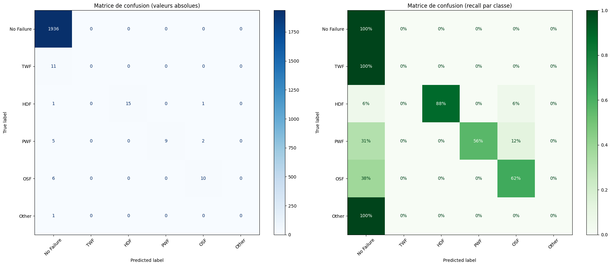
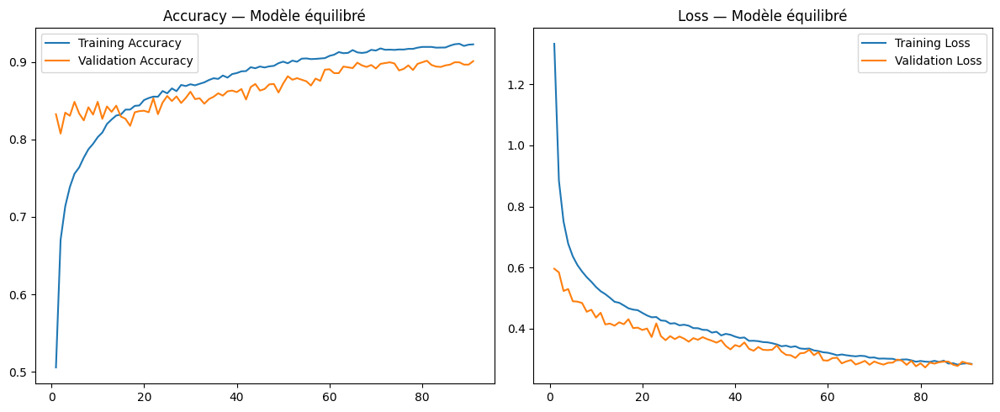

# Maintenance Prédictive par Deep Learning — Déploiement STM32L4R9

## 1. Contexte et objectif

Ce projet consiste à concevoir, entraîner et déployer un réseau de neurones profonds (DNN) capable de réaliser de la **maintenance prédictive** sur des machines industrielles.

Le jeu de données utilisé est le **AI4I 2020 Predictive Maintenance Dataset** (10 000 instances de données capteurs). L'objectif final est d'exporter le modèle entraîné pour une exécution sur une carte **STM32L4R9** via **X-CUBE-AI**.

Le projet couvre l'ensemble du cycle de développement d'un modèle de machine learning embarqué : prétraitement des données, conception et entraînement du modèle, évaluation des performances, conversion et intégration sur cible embarquée.

---

## 2. Analyse du jeu de données

### 2.1 Variables d'entrée

Le modèle utilise **6 variables** issues des capteurs de la machine :

| Variable | Description | Unité |
|----------|-------------|-------|
| Type | Type de produit (L, M, H) | Catégoriel (encodé) |
| Air temperature | Température ambiante | K |
| Process temperature | Température du processus | K |
| Rotational speed | Vitesse de rotation | rpm |
| Torque | Couple appliqué | Nm |
| Tool wear | Usure de l'outil | min |

Les colonnes `UDI` et `Product ID` sont exclues car ce sont des identifiants sans valeur prédictive.

### 2.2 Variable de sortie

Le modèle prédit **6 classes** en sortie (classification multiclasse) :

| Classe | Label | Description |
|--------|-------|-------------|
| 0 | No Failure | Fonctionnement normal |
| 1 | TWF | Tool Wear Failure — Usure de l'outil |
| 2 | HDF | Heat Dissipation Failure — Dissipation thermique |
| 3 | PWF | Power Failure — Panne de puissance |
| 4 | OSF | Overstrain Failure — Surcharge |
| 5 | Other | Panne sans type spécifique |

La classe **RNF** (Random Failure) est exclue du modèle. Par définition, une panne aléatoire n'a pas de signature capteur prédictible. De plus, le dataset ne contient qu'un seul exemple de RNF associé à une panne réelle, ce qui est insuffisant pour tout apprentissage. Les 19 lignes RNF sont retirées du dataset (9981 lignes restantes).

### 2.3 Déséquilibre des classes

Le dataset est **fortement déséquilibré** : 97% des instances correspondent à un fonctionnement normal (classe 0), et seulement 3% à des pannes. Ce déséquilibre constitue le défi principal du projet : un modèle naïf pourrait prédire systématiquement "pas de panne" et atteindre 97% d'accuracy sans jamais détecter une seule panne.

---

## 3. Architecture du modèle

Le réseau est un **MLP (Multi-Layer Perceptron)** léger, conçu pour être compatible avec les contraintes mémoire du STM32L4R9 :

```
Input (6) → Dense(32, ReLU) → Dropout(0.2) → Dense(16, ReLU) → Dropout(0.2) → Dense(6, Softmax)
```

L'architecture de base (32→16→6) est identique entre la Partie 2 et la Partie 3. En Partie 3, une **régularisation L2** (1e-3) et le **Dropout** (0.2) sont ajoutés pour limiter l'overfitting introduit par les données synthétiques SMOTE.

Le modèle contient environ **750 paramètres** (~3 KB en float32), ce qui est largement compatible avec les ressources du STM32L4R9 (2 MB Flash, 640 KB SRAM).

---

## 4. Entraînement et résultats

### 4.1 Partie 2 — Sans rééquilibrage

Le modèle est entraîné directement sur le dataset brut (déséquilibré), avec l'optimiseur Adam, une loss `sparse_categorical_crossentropy`, un batch size de 32, sur 50 époques.

#### Courbes d'entraînement


*Figure 1 — Les courbes montrent une convergence rapide avec une accuracy très élevée (~98%), mais cette performance est trompeuse car dominée par la classe majoritaire.*

#### Matrice de confusion


*Figure 2 — La matrice de recall montre que le modèle prédit quasi exclusivement "No Failure". Les classes TWF et Other ont un recall de 0%.*

#### Rapport de classification


*Figure 3 — L'accuracy globale de 98% masque un biais fort vers la classe majoritaire.*

#### Analyse

L'accuracy de 98% est trompeuse. Le modèle détecte partiellement certaines pannes à signature physique marquée (HDF à 88%, OSF à 62%, PWF à 56%), mais échoue totalement sur les classes rares (TWF et Other à 0%). Le modèle souffre d'un fort biais en faveur de la classe majoritaire. En contexte de maintenance prédictive, un tel modèle est dangereux : il rassure avec une accuracy élevée mais laisse passer une grande partie des pannes réelles. Un rééquilibrage du dataset est indispensable.

---

### 4.2 Partie 3 — Avec rééquilibrage (SMOTE partiel 30%)

#### Stratégie de rééquilibrage

On applique **SMOTE** (Synthetic Minority Oversampling Technique) sur le jeu d'entraînement uniquement, avec un **ratio partiel de 30%** : chaque classe minoritaire est augmentée à 30% de la taille de la classe majoritaire.

Ce choix résulte de plusieurs itérations :
- Un SMOTE à 100% (équilibrage total) provoquait un **overfitting sévère** (écart train/val de ~20 points).
- Une régularisation forte (Dropout 0.4, L2 5e-3) réduisait l'overfitting mais causait de l'**underfitting**.
- Le SMOTE partiel à 30% avec une régularisation modérée (Dropout 0.2, L2 1e-3) offre le meilleur compromis.

Le jeu de test reste **non modifié** (déséquilibré) pour évaluer la performance réelle du modèle en conditions de production.

#### Paramètres d'entraînement

- Optimiseur : Adam (learning rate = 1e-3)
- Loss : sparse_categorical_crossentropy
- Batch size : 64
- EarlyStopping (monitor = val_loss, patience = 10, restore_best_weights = True)
- Époques max : 150

#### Courbes d'entraînement


*Figure 4 — Les courbes train (~0.92) et validation (~0.90) convergent ensemble sans divergence significative, confirmant l'absence d'overfitting.*

#### Matrice de confusion


*Figure 5 — Le modèle détecte désormais efficacement les pannes : HDF à 100%, PWF et OSF à 81%, TWF à 55%.*

#### Rapport de classification


*Figure 6 — L'accuracy globale est de ~90% avec une nette amélioration de la détection des classes minoritaires.*

#### Analyse

Les courbes d'entraînement montrent une bonne convergence : la training accuracy (~0.92) et la validation accuracy (~0.90) sont proches, et les deux courbes de loss convergent ensemble sans divergence significative. Le SMOTE partiel à 30% combiné à la régularisation (Dropout 0.2, L2 1e-3) permet d'éviter l'overfitting.

La matrice de confusion révèle une nette amélioration de la détection des pannes par rapport à la Partie 2. Le modèle détecte désormais HDF à 100%, PWF et OSF à 81%, et TWF à 55% alors qu'il était à 0% sans rééquilibrage. Ces gains sont considérables, notamment pour TWF qui n'était pas du tout détecté en Partie 2.

L'accuracy globale passe de 98% à ~90%, mais cette baisse est due à la réduction des faux négatifs : le modèle détecte maintenant des pannes qu'il manquait complètement avant. Le compromis est environ 10% de faux positifs sur la classe "No Failure", ce qui est acceptable en maintenance prédictive : une fausse alerte engendre une simple inspection, tandis qu'une panne non détectée peut provoquer un arrêt de production coûteux.

La limite du modèle reste la classe "Other" (0% de détection, 1 seul exemple dans le test set), qui est trop rare pour être apprise même avec SMOTE.

En conclusion, le modèle avec SMOTE est nettement plus adapté à un déploiement sur STM32 pour la maintenance prédictive, car il offre un bon équilibre entre détection des pannes et taux de fausses alarmes.

---

## 5. Déploiement sur STM32L4R9

### 5.1 Export du modèle

Le modèle entraîné est sauvegardé au format **Keras (.h5)**, compatible avec X-CUBE-AI. Les données de test (`X_test.npy`, `y_test.npy`) sont également exportées pour valider l'inférence sur la carte.

### 5.2 Intégration dans STM32CubeIDE

1. Création d'un projet STM32CubeIDE pour la carte STM32L4R9
2. Activation du pack **X-CUBE-AI** dans la configuration du projet
3. Import du fichier `model_maintenance.h5`
4. Analyse automatique de la taille du réseau (RAM / Flash)
5. Génération du code C d'inférence
6. Intégration de l'appel d'inférence dans `main.c`

### 5.3 Compatibilité mémoire

| Ressource | Disponible (STM32L4R9) | Utilisé (modèle) | Statut |
|-----------|------------------------|-------------------|--------|
| Flash | 2 MB | ~3 KB | ✅ OK |
| SRAM | 640 KB | < 1 KB | ✅ OK |

Le modèle est très léger grâce à l'architecture 32→16→6, ce qui laisse une large marge pour l'application embarquée.

---

## 6. Structure du dépôt

```
├── README.md                          # Rapport du projet (ce fichier)
├── TP_IA_EMBARQUEE_BAYDI.ipynb        # Notebook Colab (entraînement et évaluation)
├── model_maintenance.h5               # Modèle Keras exporté pour STM32CubeAI
├── X_test.npy                         # Données de test — entrées
├── y_test.npy                         # Données de test — labels attendus
├── images/                            # Figures du rapport
│   ├── courbes_partie2.png
│   ├── matrice_partie2.png
│   ├── rapport_partie2.png
│   ├── courbes_partie3.png
│   ├── matrice_partie3.png
│   └── rapport_partie3.png
└── STM32CubeIDE/                      # Projet STM32 (inférence embarquée)
    ├── Core/
    │   └── Src/
    │       └── main.c
    └── X-CUBE-AI/
```

---

## 7. Conclusion

Ce projet démontre qu'il est possible de déployer un modèle de maintenance prédictive sur un microcontrôleur STM32 avec des performances de détection satisfaisantes. Le SMOTE partiel à 30% combiné à une régularisation modérée offre le meilleur compromis entre détection des pannes et taux de fausses alarmes, dans un format suffisamment compact pour l'embarqué.

---

## Auteur

**BAYDI HADDADI**
**LYSANDRE HADDADI**
