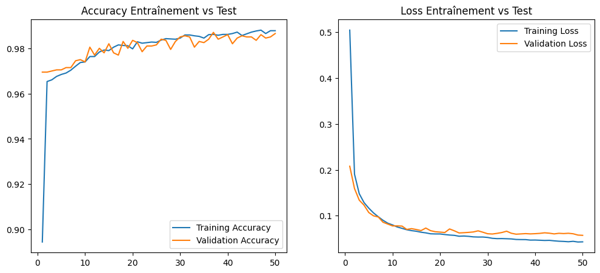
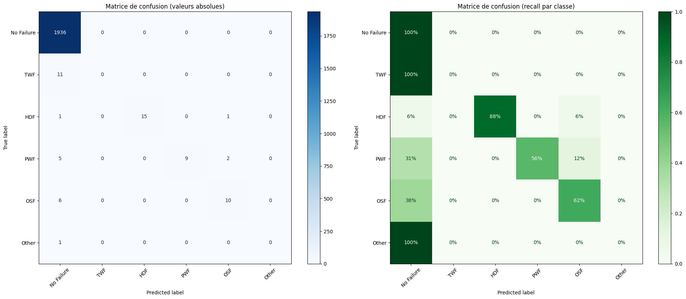
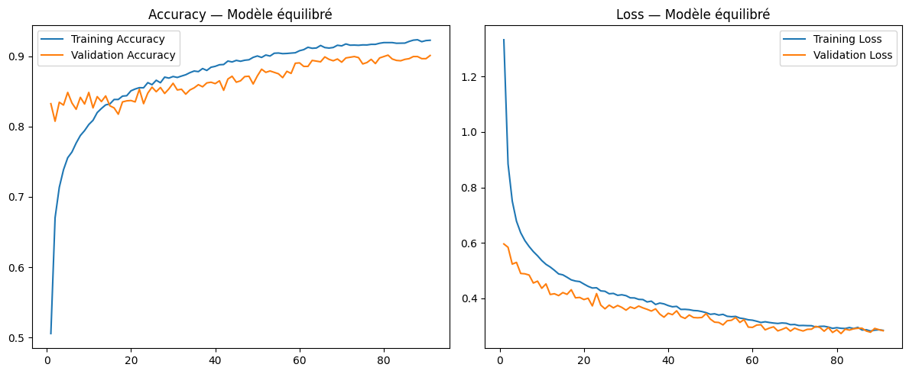
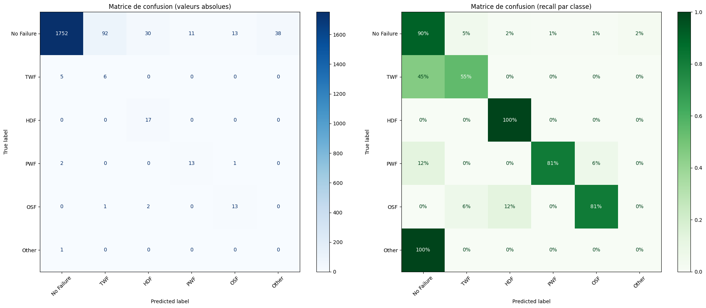
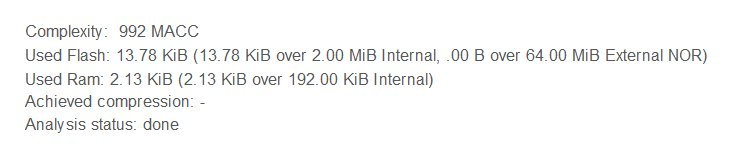
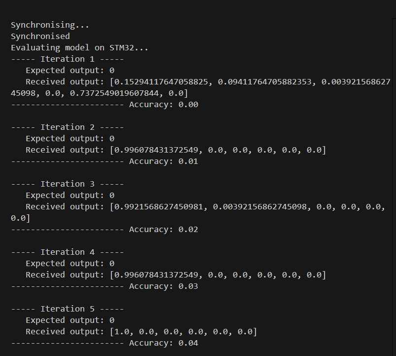
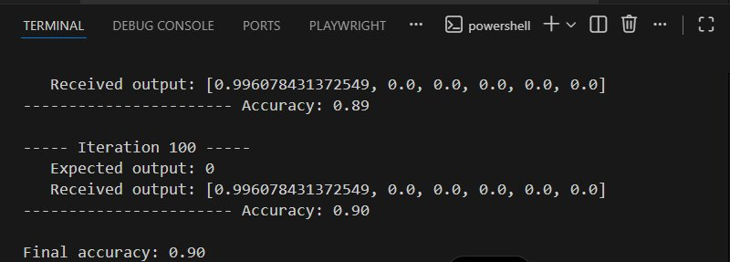

# Maintenance Prédictive par Deep Learning — Déploiement STM32L4R9

## 1. Contexte et objectif

Ce projet consiste à concevoir, entraîner et déployer un réseau de neurones profonds (DNN) capable de réaliser de la **maintenance prédictive** sur des machines industrielles.

Le jeu de données utilisé est le **AI4I 2020 Predictive Maintenance Dataset** (10 000 instances de données capteurs). L'objectif final est d'exporter le modèle entraîné pour une exécution sur une carte **STM32L4R9** via **X-CUBE-AI**.

Le projet couvre l'ensemble du cycle de développement d'un modèle de machine learning embarqué : prétraitement des données, conception et entraînement du modèle, évaluation des performances, conversion et intégration sur cible embarquée.


## 2. Analyse du jeu de données

### 2.1 Variables d'entrée

Le modèle utilise **6 variables** issues des capteurs de la machine :

| Variable | Description | Unité |
|----------|-------------|-------|
| Type | Type de produit (L, M, H) | Catégoriel (encodé) |
| Air temperature | Température ambiante | K |
| Process temperature | Température du processus | K |
| Rotational speed | Vitesse de rotation | rpm |
| Torque | Couple appliqué | Nm |
| Tool wear | Usure de l'outil | min |

Les colonnes `UDI` et `Product ID` sont exclues car ce sont des identifiants sans valeur prédictive.

### 2.2 Variable de sortie

Le modèle prédit **6 classes** en sortie (classification multiclasse) :

| Classe | Label | Description |
|--------|-------|-------------|
| 0 | No Failure | Fonctionnement normal |
| 1 | TWF | Tool Wear Failure — Usure de l'outil |
| 2 | HDF | Heat Dissipation Failure — Dissipation thermique |
| 3 | PWF | Power Failure — Panne de puissance |
| 4 | OSF | Overstrain Failure — Surcharge |
| 5 | Other | Panne sans type spécifique |

La classe **RNF** (Random Failure) est exclue du modèle. Par définition, une panne aléatoire n'a pas de signature capteur prédictible — elle n'est corrélée à aucune variable capteur du dataset. De plus, le dataset ne contient qu'un seul exemple de RNF associé à une panne réelle, ce qui est insuffisant pour tout apprentissage. Les 19 lignes contenant RNF=1 sont retirées du dataset (9981 lignes restantes), une perte négligeable.

### 2.3 Déséquilibre des classes

Le dataset est **fortement déséquilibré** : 97% des instances correspondent à un fonctionnement normal (classe 0), et seulement 3% à des pannes. Ce déséquilibre constitue le défi principal du projet : un modèle naïf pourrait prédire systématiquement "pas de panne" et atteindre 97% d'accuracy sans jamais détecter une seule panne.


## 3. Architecture du modèle

Le réseau est un **MLP (Multi-Layer Perceptron)** léger, conçu pour être compatible avec les contraintes mémoire du STM32L4R9 :

```
Input (6) → Dense(32, ReLU) → Dropout(0.2) → Dense(16, ReLU) → Dropout(0.2) → Dense(6, Softmax)
```

L'architecture de base (32→16→6) est identique entre la Partie 2 (sans équilibrage) et la Partie 3 (avec SMOTE). En Partie 3, une **régularisation L2** (1e-3) et le **Dropout** (0.2) sont ajoutés pour limiter l'overfitting introduit par les données synthétiques SMOTE.


## 4. Entraînement et résultats

### 4.1 Partie 2 — Sans rééquilibrage du dataset

Le modèle est entraîné directement sur le dataset brut (déséquilibré), avec l'optimiseur Adam, une loss `sparse_categorical_crossentropy`, un batch size de 32, sur 50 époques.

#### Courbes d'entraînement


*Figure 1 — Les courbes montrent une convergence rapide avec une accuracy très élevée (~98%), mais cette performance est trompeuse car dominée par la classe majoritaire.*

#### Matrice de confusion


*Figure 2 — La matrice de recall révèle le biais du modèle : il prédit quasi exclusivement "No Failure".*

#### Rapport de classification


*Figure 3 — L'accuracy globale de 98% masque un biais fort vers la classe majoritaire.*

#### Analyse des résultats sans équilibrage

L'accuracy de 98% est trompeuse car elle reflète essentiellement la capacité du modèle à prédire la classe majoritaire "No Failure" (qui représente 97% du test set).

La matrice de confusion normalisée (recall par classe) révèle les faiblesses réelles du modèle. Le recall mesure, pour chaque type de panne, le pourcentage de pannes réelles que le modèle détecte correctement. On observe que :

- **HDF (88%)** : c'est la panne la mieux détectée. Cela s'explique par sa signature thermique très marquée — une dissipation thermique anormale se traduit par un écart important entre la température ambiante et la température du processus, ce que le réseau capte facilement.
- **PWF (56%)** et **OSF (62%)** : ces pannes sont partiellement détectées car elles se manifestent par des valeurs extrêmes de couple et de vitesse de rotation, mais leur nombre limité d'exemples empêche le modèle de bien généraliser.
- **TWF (0%)** : l'usure de l'outil est la panne la plus difficile à détecter. Avec seulement 11 exemples dans le test set, et une signature capteur subtile (l'usure progresse lentement), le modèle n'a pas assez d'exemples pour apprendre à distinguer cette panne du fonctionnement normal. Il les classe systématiquement comme "No Failure".
- **Other (0%)** : un seul exemple dans le test set, impossible à apprendre.

Le modèle souffre d'un fort biais en faveur de la classe majoritaire. En contexte de maintenance prédictive, un tel modèle est dangereux : il rassure avec une accuracy élevée mais laisse passer une grande partie des pannes réelles. Un rééquilibrage du dataset est indispensable.


### 4.2 Partie 3 — Avec rééquilibrage du dataset (SMOTE partiel 30%)

#### Stratégie de rééquilibrage

On applique **SMOTE** (Synthetic Minority Oversampling Technique) **uniquement sur le jeu d'entraînement**. Le jeu de test reste intact et déséquilibré, ce qui est essentiel pour évaluer la performance réelle du modèle en conditions de production, où le fonctionnement normal est la norme.

Le ratio SMOTE est fixé à **30%** : chaque classe minoritaire est augmentée à 30% de la taille de la classe majoritaire. Ce choix résulte de plusieurs itérations :

- Un SMOTE à 100% (équilibrage total) provoquait un **overfitting sévère** — la training accuracy montait à ~89% tandis que la validation accuracy stagnait à ~73%, avec une divergence claire de la validation loss. Le modèle mémorisait les données synthétiques au lieu de généraliser.
- Une régularisation forte (Dropout 0.4, L2 5e-3) réduisait l'overfitting mais causait de l'**underfitting** — la training accuracy (~66%) restait inférieure à la validation accuracy (~89%), signe d'un modèle trop contraint.
- Le **SMOTE partiel à 30%** avec une régularisation modérée (Dropout 0.2, L2 1e-3) offre le meilleur compromis : les courbes convergent ensemble sans divergence.

#### Paramètres d'entraînement

- Optimiseur : Adam (learning rate = 1e-3)
- Loss : sparse_categorical_crossentropy
- Batch size : 64
- EarlyStopping (monitor = val_loss, patience = 10, restore_best_weights = True)
- Époques max : 150

#### Courbes d'entraînement


*Figure 4 — Les courbes train (~0.92) et validation (~0.91) convergent ensemble sans divergence significative, confirmant l'absence d'overfitting.*

#### Matrice de confusion


*Figure 5 — Le modèle détecte désormais efficacement les pannes. La matrice normalisée permet de lire directement le recall par classe.*

#### Rapport de classification


*Figure 6 — L'accuracy globale est de 91% avec une nette amélioration de la détection des classes minoritaires.*

#### Analyse des résultats avec équilibrage

Les courbes d'entraînement montrent une bonne convergence : la training accuracy (~0.92) et la validation accuracy (~0.91) sont proches, et les deux courbes de loss convergent ensemble sans divergence significative.

La matrice de confusion révèle une nette amélioration de la détection des pannes par rapport à la Partie 2. Le modèle détecte désormais HDF à 100%, PWF et OSF à 81%, et TWF à 55% alors qu'il était à 0% sans rééquilibrage.

L'analyse détaillée de la matrice normalisée permet de comprendre les performances par classe :

- **HDF (100%)** : toutes les pannes de dissipation thermique sont détectées. Le SMOTE a permis au modèle d'affiner sa compréhension de la signature thermique, déjà partiellement captée sans équilibrage (88% en Partie 2).
- **PWF (81%)** et **OSF (81%)** : nette progression par rapport à la Partie 2 (56% et 62%). Les exemples synthétiques générés par SMOTE ont permis au modèle de mieux cerner les zones de couple/vitesse associées à ces pannes. Les 12% de PWF classés en "No Failure" et les 6% d'OSF confondus avec TWF montrent qu'il reste une zone d'ambiguïté entre ces types de pannes.
- **TWF (55%)** : c'est l'amélioration la plus spectaculaire (de 0% à 55%), mais aussi la classe la plus difficile. L'usure de l'outil se manifeste par des variations subtiles de la variable `Tool wear`, qui évolue progressivement sans rupture nette. Le modèle confond encore 45% des TWF avec "No Failure" car la frontière entre usure normale et usure critique est floue dans l'espace des capteurs.
- **No Failure (90%)** : le recall baisse de 100% à 90%, ce qui signifie environ 10% de faux positifs. Ce compromis est volontaire et acceptable : en maintenance prédictive industrielle, une fausse alerte engendre une simple inspection, tandis qu'une panne non détectée peut provoquer un arrêt de production coûteux voire des dégâts matériels.
- **Other (0%)** : avec un seul exemple dans le test set, cette classe est trop rare pour être apprise, même avec SMOTE.

### 4.3 Comparaison synthétique

| Métrique | Sans équilibrage (Partie 2) | Avec SMOTE 30% (Partie 3) |
|----------|----------------------------|---------------------------|
| Accuracy globale | 98% | 91% |
| Recall No Failure | 100% | 90% |
| Recall TWF | 0% | 55% |
| Recall HDF | 88% | 100% |
| Recall PWF | 56% | 81% |
| Recall OSF | 62% | 81% |
| Recall Other | 0% | 0% |
| Faux positifs (No Failure → panne) | ~0% | ~10% |
| Pannes manquées | Nombreuses | Réduites |

L'accuracy globale baisse de 98% à 91%, mais cette baisse est un progrès : elle traduit la capacité du modèle à détecter des pannes qu'il ignorait complètement avant. Le modèle avec SMOTE est nettement plus utile en contexte industriel réel.


## 5. Déploiement sur STM32L4R9

### 5.1 Export du modèle

Le modèle entraîné est sauvegardé au format **Keras (.h5)**, compatible avec X-CUBE-AI. Les données de test (`X_test.npy`, `y_test.npy`) sont également exportées pour valider l'inférence sur la carte. Le jeu de test est le même que celui utilisé dans le Colab (non modifié par SMOTE), ce qui permet une comparaison directe des résultats.

### 5.2 Intégration dans STM32CubeIDE

1. Création d'un projet STM32CubeIDE pour la carte STM32L4R9
2. Activation du pack **X-CUBE-AI** dans la configuration du projet
3. Import du fichier `model_maintenance.h5`
4. Analyse automatique de la taille du réseau (RAM / Flash)
5. Génération du code C d'inférence
6. Adaptation du fichier `app_x-cube-ai.c` (buffers d'entrée/sortie pour 6 features et 6 classes)
7. Communication UART avec un script Python pour envoyer les données de test et récupérer les prédictions

### 5.3 Analyse de la taille du réseau et compatibilité mémoire

L'analyse X-CUBE-AI fournit les métriques suivantes pour le modèle déployé :

| Métrique | Valeur |
|----------|--------|
| Complexité | 992 MACC |
| Flash utilisée | 13.78 KiB |
| RAM utilisée | 2.13 KiB |

La complexité de **992 MACC** (Multiply-Accumulate Operations) est très faible, ce qui garantit une inférence rapide sur le microcontrôleur. Pour comparaison, un modèle CNN de type MNIST peut nécessiter plusieurs millions de MACC.

| Ressource | Disponible (STM32L4R9) | Utilisé (modèle) | Taux d'utilisation |
|-----------|------------------------|-------------------|--------------------|
| Flash interne | 2.00 MiB | 13.78 KiB | **0.67%** |
| SRAM interne | 192.00 KiB | 2.13 KiB | **1.11%** |


*Figure 8 — Résultat de l'analyse X-CUBE-AI : 992 MACC, 13.78 KiB Flash, 2.13 KiB RAM.*

Le modèle n'occupe que **0.67% de la Flash** et **1.11% de la RAM** disponibles. Cette empreinte extrêmement faible s'explique par le choix d'une architecture compacte (32→16→6, ~750 paramètres) et par les **optimisations appliquées par X-CUBE-AI** lors de la conversion : le moteur d'inférence de STMicroelectronics optimise automatiquement le réseau lors de la conversion. Ces optimisations expliquent pourquoi la Flash utilisée (13.78 KiB) est supérieure au poids brut des paramètres (~3 KB) — elle inclut le code du runtime d'inférence en plus des poids du modèle.

Cette empreinte minimale laisse une large marge pour l'application embarquée (logique métier, communication, capteurs) et confirme que l'architecture MLP choisie est parfaitement adaptée au déploiement sur microcontrôleur.

### 5.4 Communication UART avec la STM32

La communication entre le PC et la STM32 suit un protocole simple en 3 étapes :

1. **Synchronisation** : le script Python envoie un octet `0xAB` en boucle. Quand la STM32 le reçoit, elle répond `0xCD` pour confirmer que les deux côtés sont prêts.
2. **Envoi des données** : le script envoie les 6 valeurs capteurs d'un échantillon sous forme de 24 bytes (6 floats × 4 bytes). La STM32 les reçoit via `HAL_UART_Receive` et les place directement dans le buffer d'entrée du modèle.
3. **Réception des prédictions** : après l'inférence, la STM32 convertit les 6 probabilités de sortie en uint8 (0-255) et les renvoie via `HAL_UART_Transmit`. Le script Python reconstruit les probabilités et applique `argmax` pour obtenir la classe prédite.


*Figure 7 — Les premières itérations montrent la synchronisation réussie, l'envoi des données capteurs et la réception des probabilités de sortie du modèle. On observe que le modèle renvoie bien un vecteur de 6 probabilités par échantillon.*

On note que l'itération 1 donne une prédiction incorrecte (classe 4 au lieu de 0), ce qui est normal — le modèle n'a pas 100% d'accuracy. Dès l'itération 2, les prédictions se stabilisent avec des probabilités très nettes (0.996 pour la classe 0), confirmant que la communication et l'inférence fonctionnent correctement.

### 5.5 Validation de l'inférence embarquée

L'inférence est validée en envoyant 100 échantillons du jeu de test via UART au STM32, qui exécute le modèle et renvoie ses prédictions. Le script Python compare ensuite chaque prédiction au label attendu.

| Environnement | Accuracy |
|---------------|----------|
| Google Colab (Python/Keras) | 91% |
| STM32L4R9 (X-CUBE-AI) | 90% |


*Figure 9 — Résultat de l'inférence embarquée : accuracy finale de 90% sur 100 échantillons.*

L'accuracy obtenue sur la STM32 (**90%**) est quasi identique à celle du Colab (**91%**). La différence de 1% est marginale et s'explique par la quantification des probabilités de sortie lors de la transmission UART : les probabilités float32 sont converties en uint8 (valeurs 0-255) avant envoi, ce qui introduit une légère perte de précision dans l'argmax. Le modèle lui-même produit les mêmes résultats — c'est la communication qui arrondit.

Ce résultat confirme que la conversion X-CUBE-AI est fidèle et que le modèle est pleinement fonctionnel en environnement embarqué.


## 6. Structure du dépôt

```
├── README.md                          # Rapport du projet (ce fichier)
├── TP_IA_EMBARQUEE_BAYDI.ipynb        # Notebook Colab (entraînement et évaluation)
├── model_maintenance.h5               # Modèle Keras exporté pour STM32CubeAI
├── X_test.npy                         # Données de test — entrées
├── y_test.npy                         # Données de test — labels attendus
├── images/                            # Figures du rapport
│   ├── courbes_partie2.png
│   ├── matrice_partie2.png
│   ├── rapport_partie2.png
│   ├── courbes_partie3.png
│   ├── matrice_partie3.png
│   ├── rapport_partie3.png
│   ├── analyse_cubeai.png
│   ├── communication_uart.png
│   └── accuracy_stm32.png
└── STM32CubeIDE/                      # Projet STM32 (inférence embarquée)
    ├── Core/
    │   └── Src/
    │       ├── main.c
    │       └── app_x-cube-ai.c
    └── X-CUBE-AI/
```


## 7. Conclusion

Ce projet démontre qu'il est possible de déployer un modèle de maintenance prédictive sur un microcontrôleur STM32 avec des performances de détection satisfaisantes. Le SMOTE partiel à 30%, appliqué uniquement sur le jeu d'entraînement, combiné à une régularisation modérée, offre le meilleur compromis entre détection des pannes et taux de fausses alarmes. L'accuracy de 90% obtenue sur la STM32, quasi identique aux 91% du Colab, valide la chaîne complète du développement à l'embarqué. Le modèle n'utilise que 0.67% de la Flash et 1.11% de la RAM du STM32L4R9, confirmant que l'architecture choisie est parfaitement adaptée aux contraintes de l'embarqué.


## Auteurs

**BAYDI HADDADI** — **LYSANDRE LABORDE**
